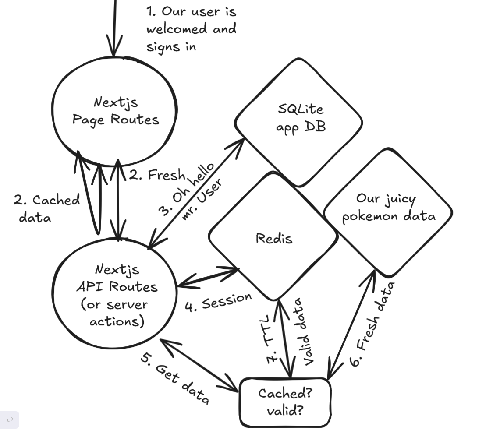

# redis-nextjs-txtfl-pkmn

This project is a small but feature complete application build with Nextjs, Redis and Sqlite and it aims to show all the core concepts of a web app with a BFF (Backend for Frontend)

You know we all love pokemons so that's our experience for registering what Pokémons and how many of those we fought (and won!) in our evenings playing Pokémon Duel.

## What is this application doing?

After you sign in you'll be able to view a list of Pokémons where you can add your records of your wins and losses.
You will be able to see your records and have a custom search/autocomplete Pokemons experience.

## Project Structure

## FAQ

Developing in this repo: [instructions](./docs/developing.md):
Why am I using Nextjs: [instructions](./docs/why-nextjs.md):
Why am I using Sass: [instructions](./docs/why-sass.md):
Why am I using Redis: [instructions](./docs/why-redis.md):
Why am I using SQLite: [instructions](./docs/why-sqlite.md):
